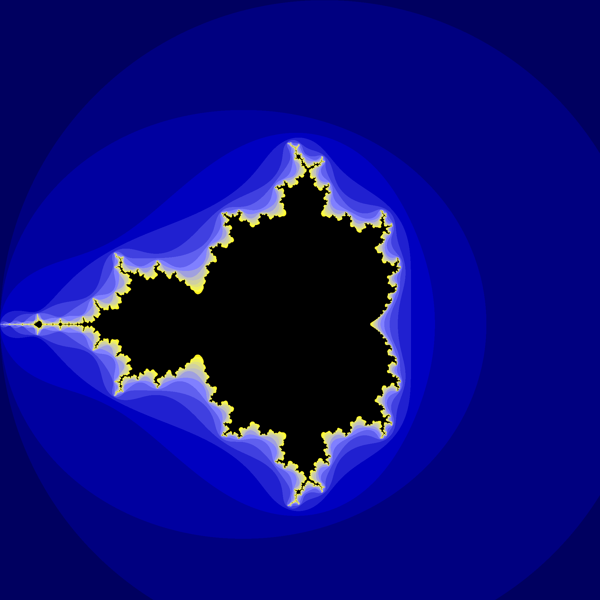

# Yet another Rust Mandelbrot set renderer

## Running
```bash
cargo run --release
```

## Command-line options
```bash
$ mandelbrot --help
Simple mandelbrot fractal renderer

Usage: mandelbrot [OPTIONS]

Options:
  -f, --file-path <FILE_PATH>  Output image path [default: fractal.png]
      --width <WIDTH>          Output image width [default: 1000]
      --height <HEIGHT>        Output image width [default: 1000]
      --bounds <BOUNDS>        Start/End coordinate on the complex plane (both x and y) [default: "-2.0, 2.0"]
  -n, --n-max <N_MAX>          Number of iterations to do before assuming point is in the set [default: 64]
  -s, --s-max <S_MAX>          Anti-aliasing [default: 4]
  -h, --help                   Print help
  -V, --version                Print version
```

## Example Run
The following command will render a `fractal.png` file in the current directory.
```bash
$ cargo run --release -- --bounds="-2.0,1.7" --width 2000 --height 2000 -n 16 -s 4
```



## Sample Images
### Resolution: 5000x5000, n_max = 64, s_max = 8, range: -2.0, 2.0, time: 0m12,828s


### Resolution: 5000x5000, n_max = 256, s_max = 8, range: 0.2, 0.5, time: 2m19,883s


### Resolution: 5000x5000, n_max = 256, s_max = 8, range: 0.35, 0.45, time: 0m30,843s


### Resolution: 5000x5000, n_max = 512, s_max = 8, range: 0.35, 0.36, time: 1m30,134s
