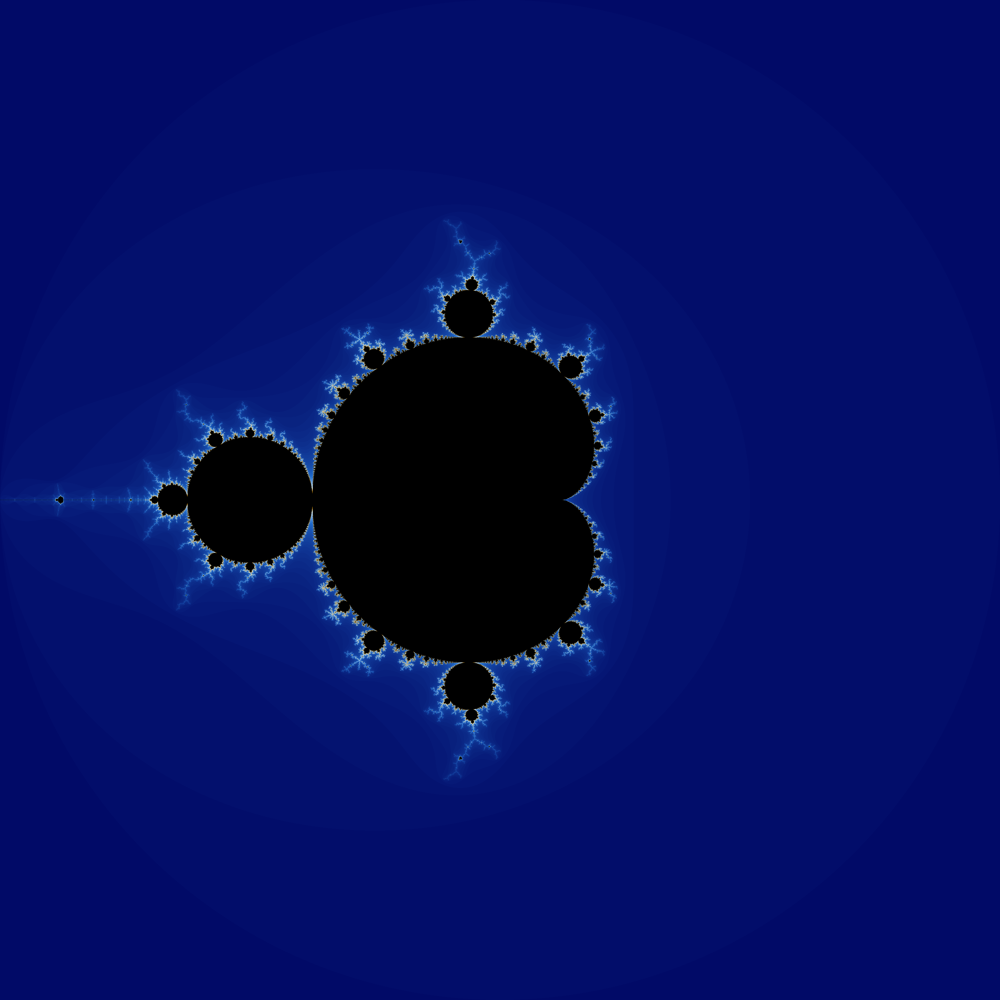
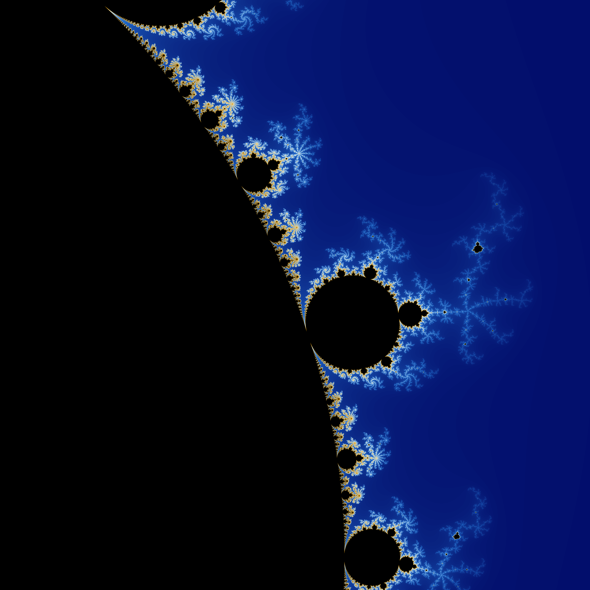
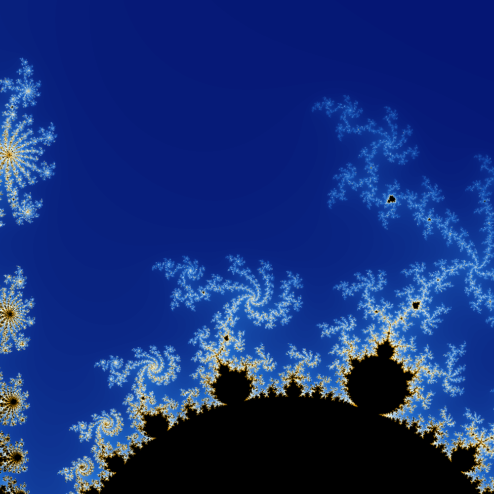
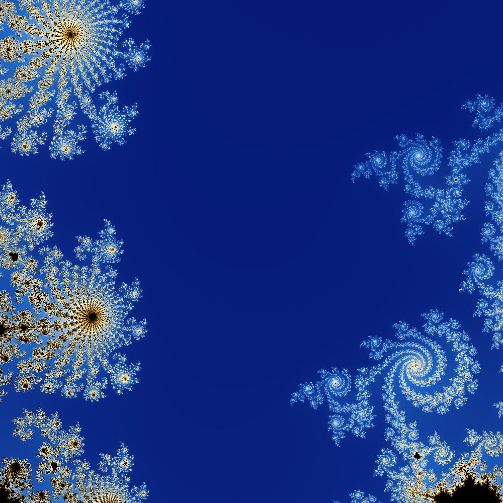

# Mandelbrot set renderer


## Compilation (Ubuntu 22.04)
```
sudo apt-get install libsfml-dev
cd Mandelbrot
make
```

## Running

```
./mandelbrot
```

## Converting output to png

```
sudo apt install sudo apt install imagemagick
convert file.ppm file.png
```

## Sample Images

### Resolution: 5000x5000, n_max = 64, s_max = 8, range: -2.0, 2.0, time: 0m12,828s


### Resolution: 5000x5000, n_max = 256, s_max = 8, range: 0.2, 0.5, time: 2m19,883s


### Resolution: 5000x5000, n_max = 256, s_max = 8, range: 0.35, 0.45, time: 0m30,843s


### Resolution: 5000x5000, n_max = 512, s_max = 8, range: 0.35, 0.36, time: 1m30,134s
